Training A Ridge Regression Model
================

### Libraries

``` r
library(data.table)
library(dplyr)
library(ISLR)
library(glmnet)
library(MASS)
library(car)
```

### Finding the best lambda for our multilinear model of quantitative features

#### (This is the csv that grouped all the quantitative features)

``` r
quant_df = fread('train_quants.csv')

#Remove index column 
quant_df$V1 = NULL

#create a multi-linear model with for SalePrice vs quant. features
model = lm(SalePrice ~ ., data = quant_df)
summary(model)
```

    ## 
    ## Call:
    ## lm(formula = SalePrice ~ ., data = quant_df)
    ## 
    ## Residuals:
    ##     Min      1Q  Median      3Q     Max 
    ## -530105  -19216    -887   17520  306967 
    ## 
    ## Coefficients: (2 not defined because of singularities)
    ##                 Estimate Std. Error t value Pr(>|t|)    
    ## (Intercept)    3.091e+04  7.106e+03   4.350 1.46e-05 ***
    ## LotFrontage    2.202e+01  5.584e+01   0.394 0.693315    
    ## LotArea        1.705e-01  1.161e-01   1.469 0.142138    
    ## MasVnrArea     3.870e+01  6.687e+00   5.787 8.80e-09 ***
    ## BsmtFinSF1     3.566e+01  5.213e+00   6.840 1.17e-11 ***
    ## BsmtFinSF2     1.861e+01  8.012e+00   2.322 0.020353 *  
    ## BsmtUnfSF      3.179e+01  4.572e+00   6.953 5.42e-12 ***
    ## TotalBsmtSF           NA         NA      NA       NA    
    ## `1stFlrSF`     4.938e+01  6.492e+00   7.606 5.10e-14 ***
    ## `2ndFlrSF`     4.622e+01  5.197e+00   8.894  < 2e-16 ***
    ## LowQualFinSF   9.862e-01  2.212e+01   0.045 0.964447    
    ## GrLivArea             NA         NA      NA       NA    
    ## BsmtFullBath   1.285e+04  2.926e+03   4.393 1.20e-05 ***
    ## BsmtHalfBath   4.162e+03  4.636e+03   0.898 0.369411    
    ## FullBath       2.169e+04  2.754e+03   7.876 6.65e-15 ***
    ## HalfBath       6.343e+03  2.843e+03   2.231 0.025843 *  
    ## BedroomAbvGr  -1.548e+04  1.866e+03  -8.296 2.45e-16 ***
    ## KitchenAbvGr  -5.346e+04  5.299e+03 -10.089  < 2e-16 ***
    ## TotRmsAbvGrd   7.393e+03  1.397e+03   5.291 1.40e-07 ***
    ## Fireplaces     5.115e+03  1.989e+03   2.572 0.010207 *  
    ## GarageCars     2.009e+04  3.190e+03   6.298 4.00e-10 ***
    ## GarageArea     4.216e+00  1.109e+01   0.380 0.703928    
    ## WoodDeckSF     3.233e+01  9.085e+00   3.559 0.000385 ***
    ## OpenPorchSF    1.640e+01  1.723e+01   0.952 0.341418    
    ## EnclosedPorch -2.485e+01  1.809e+01  -1.373 0.169817    
    ## `3SsnPorch`    2.421e+01  3.585e+01   0.675 0.499565    
    ## ScreenPorch    4.304e+01  1.950e+01   2.208 0.027415 *  
    ## PoolArea      -3.853e+01  2.703e+01  -1.425 0.154266    
    ## MiscVal        7.592e-01  2.115e+00   0.359 0.719705    
    ## ---
    ## Signif. codes:  0 '***' 0.001 '**' 0.01 '*' 0.05 '.' 0.1 ' ' 1
    ## 
    ## Residual standard error: 39750 on 1433 degrees of freedom
    ## Multiple R-squared:  0.7541, Adjusted R-squared:  0.7496 
    ## F-statistic:   169 on 26 and 1433 DF,  p-value: < 2.2e-16

``` r
plot(model)
```

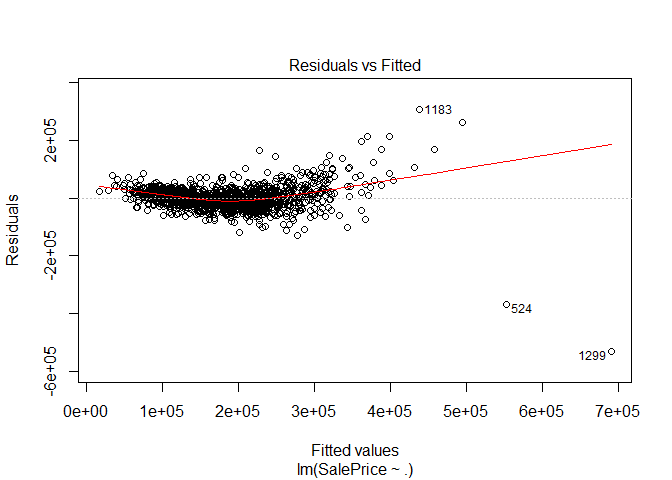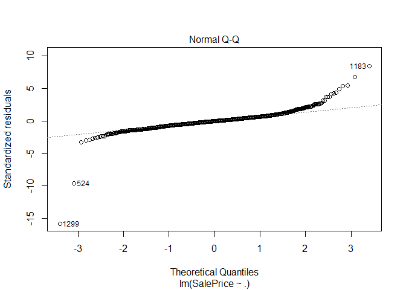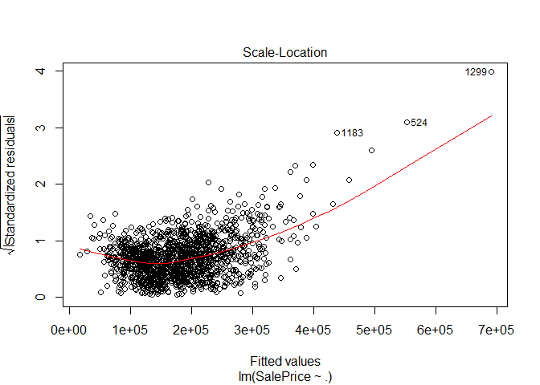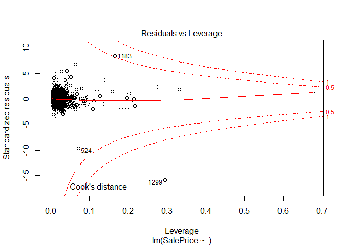

``` r
influencePlot(model)
```

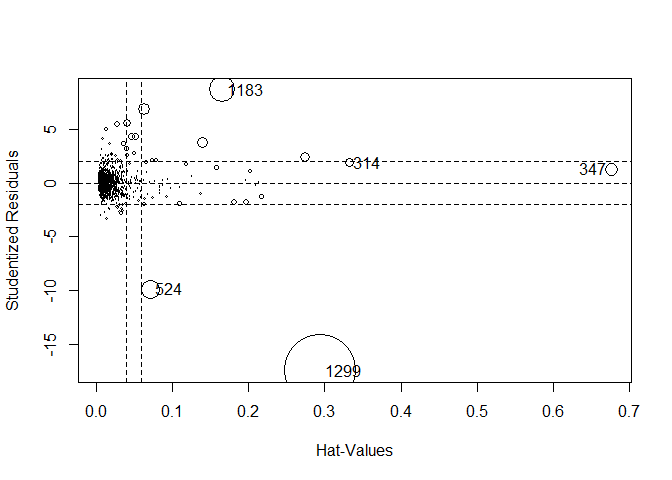
<script data-pagedtable-source type="application/json">
{"columns":[{"label":[""],"name":["_rn_"],"type":[""],"align":["left"]},{"label":["StudRes"],"name":[1],"type":["dbl"],"align":["right"]},{"label":["Hat"],"name":[2],"type":["dbl"],"align":["right"]},{"label":["CookD"],"name":[3],"type":["dbl"],"align":["right"]}],"data":[{"1":"1.872472","2":"0.33175558","3":"0.06435631","_rn_":"314"},{"1":"1.312504","2":"0.67590761","3":"0.13299552","_rn_":"347"},{"1":"-9.930949","2":"0.07143492","3":"0.26308353","_rn_":"524"},{"1":"8.672107","2":"0.16593653","3":"0.52686833","_rn_":"1183"},{"1":"-17.479848","2":"0.29420616","3":"3.89041171","_rn_":"1299"}],"options":{"columns":{"min":{},"max":[10]},"rows":{"min":[10],"max":[10]},"pages":{}}}
  </script>

``` r
#From residuals vs. leverage and influence plot, find outliers (524, 1183, 1299)
#Remove these outliers from the dataframe
quant_df = quant_df[-c(524, 1183, 1299),]
```

``` r
#overwrite model variable using new dataframe
model = lm(SalePrice ~ ., data = quant_df)
#apply boxcox() to our model
model.transformed = boxcox(model, lambda = seq(-2, 2, 1/10), plotit = TRUE,
       interp = T, eps = 1/50, xlab = expression(lambda),
       ylab = "log-Likelihood")
```

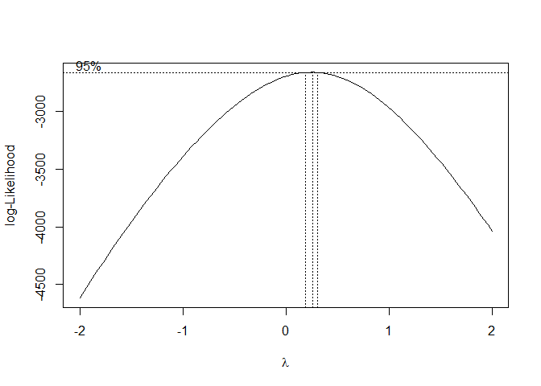

``` r
#Extracting best lambda by finding the maximum log-likelihood.
lambda = model.transformed$x[which(model.transformed$y == max(model.transformed$y))] #the best lambda for our model is                                                                                            0.26262626262.
```

### Apply boxcox transfomation to all cells of dataframe

If you look at the distribution of all the quantitative features in the dataset, none of them are nomrally distributed. By normalizing our features using boxcox transformation, we can fine-tune our model's accuracy. *note* some of the features could benefit from log transformation instead of boxcox (check out the "LotFrontage" distribution).

``` r
#Define a function "bc" that applies the boxcox formula to a variable "obs"
bc <- function (obs, lambda) {(obs^lambda-1)/lambda }

#Use mapply() to apply the bc function to our dataset using our best lambda (0.26262626262)
quant_df_bc = mapply(bc,quant_df,lambda)

#convert quant_df_bc to dataframe
quant_df_bc = data.frame(quant_df_bc)

#new multilinear model that uses our boxcox transfomed dataframe
model.bc = lm(SalePrice ~ ., data = quant_df_bc)
plot(model.bc)
```

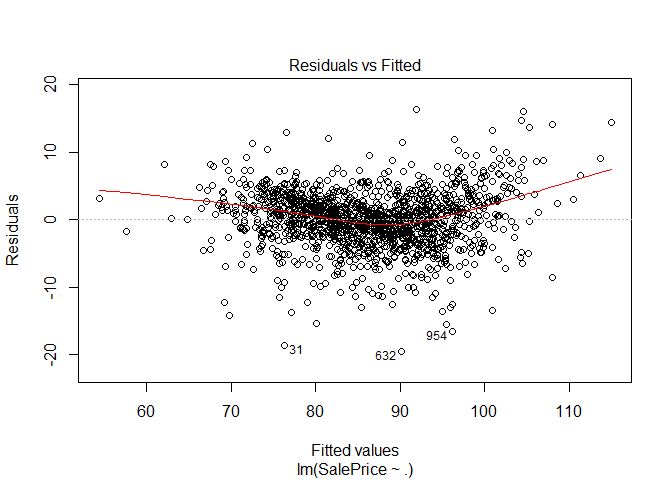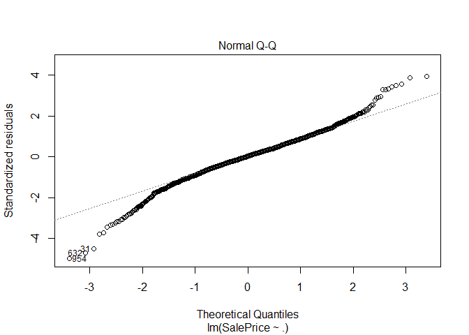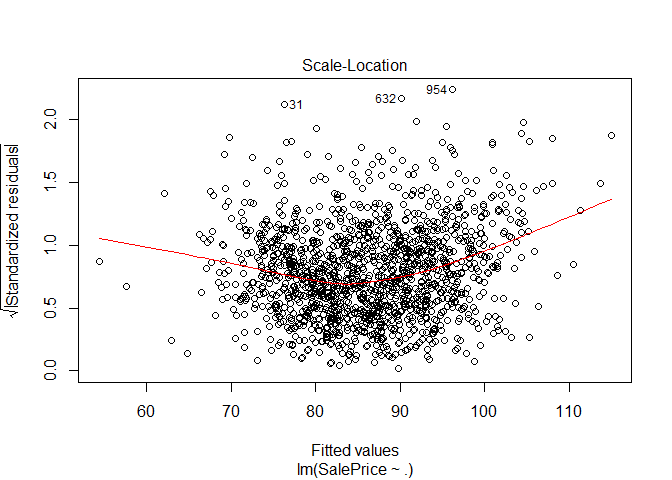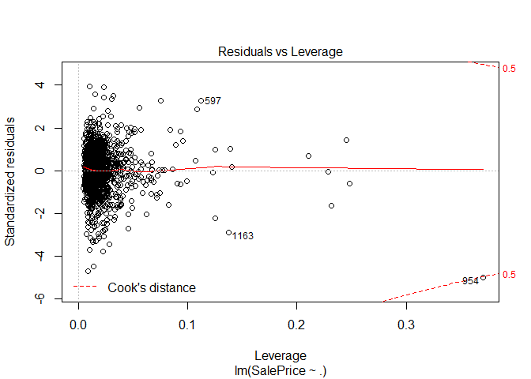

``` r
#a new outlier at index 954 is revealed
#remove outlier
quant_df_bc = quant_df_bc[-c(954),]
model.bc = lm(SalePrice ~ ., data = quant_df_bc)
plot(model.bc)
```

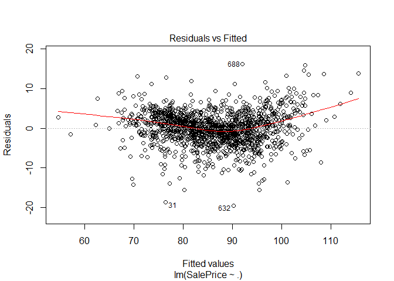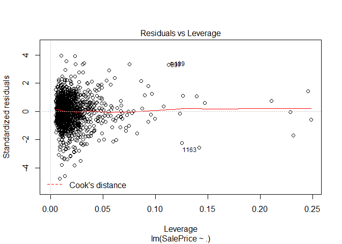

``` r
summary(model.bc)
```

    ## 
    ## Call:
    ## lm(formula = SalePrice ~ ., data = quant_df_bc)
    ## 
    ## Residuals:
    ##      Min       1Q   Median       3Q      Max 
    ## -19.5271  -2.2561   0.1836   2.4746  16.2521 
    ## 
    ## Coefficients:
    ##                Estimate Std. Error t value Pr(>|t|)    
    ## (Intercept)   19.682981   2.543634   7.738 1.90e-14 ***
    ## LotFrontage    0.477617   0.151533   3.152 0.001656 ** 
    ## LotArea        0.110146   0.025401   4.336 1.55e-05 ***
    ## MasVnrArea     0.070322   0.016036   4.385 1.24e-05 ***
    ## BsmtFinSF1     0.026798   0.017984   1.490 0.136421    
    ## BsmtFinSF2    -0.095021   0.021622  -4.395 1.19e-05 ***
    ## BsmtUnfSF     -0.038561   0.029611  -1.302 0.193034    
    ## TotalBsmtSF    0.258618   0.043992   5.879 5.14e-09 ***
    ## X1stFlrSF     -0.633006   0.256068  -2.472 0.013551 *  
    ## X2ndFlrSF     -0.271372   0.047768  -5.681 1.62e-08 ***
    ## LowQualFinSF  -0.303152   0.056151  -5.399 7.84e-08 ***
    ## GrLivArea      3.047444   0.292145  10.431  < 2e-16 ***
    ## BsmtFullBath   0.422802   0.081140   5.211 2.16e-07 ***
    ## BsmtHalfBath   0.160498   0.132987   1.207 0.227685    
    ## FullBath       3.548975   0.300959  11.792  < 2e-16 ***
    ## HalfBath       0.427701   0.084012   5.091 4.04e-07 ***
    ## BedroomAbvGr  -3.541983   0.310364 -11.412  < 2e-16 ***
    ## KitchenAbvGr  -7.988376   0.773122 -10.333  < 2e-16 ***
    ## TotRmsAbvGrd   1.636767   0.570527   2.869 0.004180 ** 
    ## Fireplaces     0.179852   0.068088   2.641 0.008345 ** 
    ## GarageCars     0.567572   0.501622   1.131 0.258046    
    ## GarageArea     0.079730   0.115025   0.693 0.488326    
    ## WoodDeckSF     0.081716   0.015789   5.175 2.60e-07 ***
    ## OpenPorchSF    0.091002   0.021123   4.308 1.76e-05 ***
    ## EnclosedPorch -0.079407   0.023683  -3.353 0.000821 ***
    ## X3SsnPorch     0.008101   0.056517   0.143 0.886050    
    ## ScreenPorch    0.028001   0.027899   1.004 0.315705    
    ## PoolArea       0.035896   0.092099   0.390 0.696773    
    ## MiscVal       -0.040731   0.026207  -1.554 0.120348    
    ## ---
    ## Signif. codes:  0 '***' 0.001 '**' 0.01 '*' 0.05 '.' 0.1 ' ' 1
    ## 
    ## Residual standard error: 4.13 on 1427 degrees of freedom
    ## Multiple R-squared:  0.8147, Adjusted R-squared:  0.8111 
    ## F-statistic: 224.1 on 28 and 1427 DF,  p-value: < 2.2e-16

``` r
vif(model.bc)
```

    ##   LotFrontage       LotArea    MasVnrArea    BsmtFinSF1    BsmtFinSF2 
    ##      1.757068      1.849702      1.343186      2.665639      1.300438 
    ##     BsmtUnfSF   TotalBsmtSF     X1stFlrSF     X2ndFlrSF  LowQualFinSF 
    ##      3.199236      3.034056     22.069824     22.999703      1.377330 
    ##     GrLivArea  BsmtFullBath  BsmtHalfBath      FullBath      HalfBath 
    ##     35.934144      1.999275      1.156179      2.051781      2.065095 
    ##  BedroomAbvGr  KitchenAbvGr  TotRmsAbvGrd    Fireplaces    GarageCars 
    ##      2.059332      1.365146      4.489388      1.538214     25.468505 
    ##    GarageArea    WoodDeckSF   OpenPorchSF EnclosedPorch    X3SsnPorch 
    ##     25.426678      1.212377      1.370022      1.162938      1.026091 
    ##   ScreenPorch      PoolArea       MiscVal 
    ##      1.089233      1.030475      1.039570

``` r
coef(model.bc) #Looking at the coefficients: TotRmsAbvGrd, GrLiVArea, BedroomAbvGr, FullBath, and (especially) KitchenAbvGr have high coefficients.  This suggests some sort of colinearity amongst these features.  If we remove these features, we can further tune the model.
```

    ##   (Intercept)   LotFrontage       LotArea    MasVnrArea    BsmtFinSF1 
    ##  19.682980921   0.477616967   0.110146201   0.070321968   0.026798311 
    ##    BsmtFinSF2     BsmtUnfSF   TotalBsmtSF     X1stFlrSF     X2ndFlrSF 
    ##  -0.095021238  -0.038561303   0.258617775  -0.633005790  -0.271371734 
    ##  LowQualFinSF     GrLivArea  BsmtFullBath  BsmtHalfBath      FullBath 
    ##  -0.303152257   3.047444202   0.422801567   0.160497501   3.548975475 
    ##      HalfBath  BedroomAbvGr  KitchenAbvGr  TotRmsAbvGrd    Fireplaces 
    ##   0.427701151  -3.541983428  -7.988375501   1.636766759   0.179851737 
    ##    GarageCars    GarageArea    WoodDeckSF   OpenPorchSF EnclosedPorch 
    ##   0.567572358   0.079730051   0.081716435   0.091001830  -0.079406805 
    ##    X3SsnPorch   ScreenPorch      PoolArea       MiscVal 
    ##   0.008100503   0.028001282   0.035896398  -0.040731449

### Creating a ridge regression model

``` r
#define x and y for our ridge regression
x = model.matrix(SalePrice ~ ., data = quant_df_bc)[, -1] #Dropping the intercept column.
y = quant_df_bc$SalePrice
#define grid for our ridge regression
grid = 10^seq(5, -3, length = 100)
#create our ridge model using x, y, and grid.
ridge.models = glmnet(x, y, alpha = 0, lambda = grid)

plot(ridge.models, xvar = "lambda", label = TRUE, main = "Ridge Regression")
```

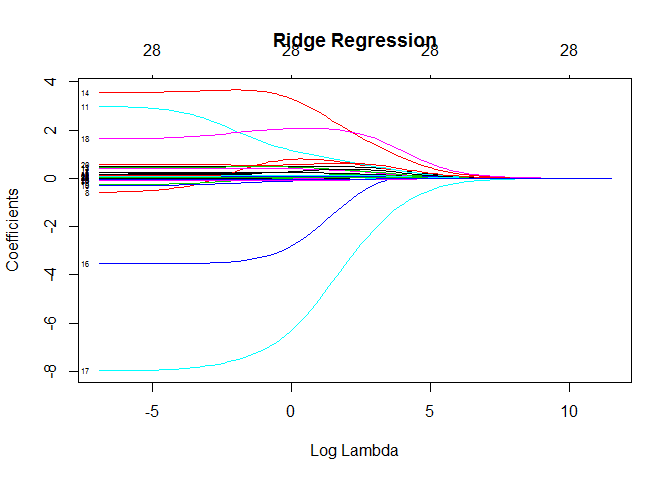 \#\#\#Training our model using 10-Fold Cross-Validation

``` r
#train on 70% test on 30%
set.seed(0)
train = sample(1:nrow(x), 7*nrow(x)/10)
test = (-train)
y.test = y[test]

#Double check 70/30 train/test split
length(train)/nrow(x)
```

    ## [1] 0.6998626

``` r
length(y.test)/nrow(x)
```

    ## [1] 0.3001374

``` r
#Running 10-fold cross validation.
set.seed(0)
cv.ridge.out = cv.glmnet(x[train, ], y[train],
                         lambda = grid, alpha = 0, nfolds = 10)
plot(cv.ridge.out, main = "Ridge Regression\n")
```

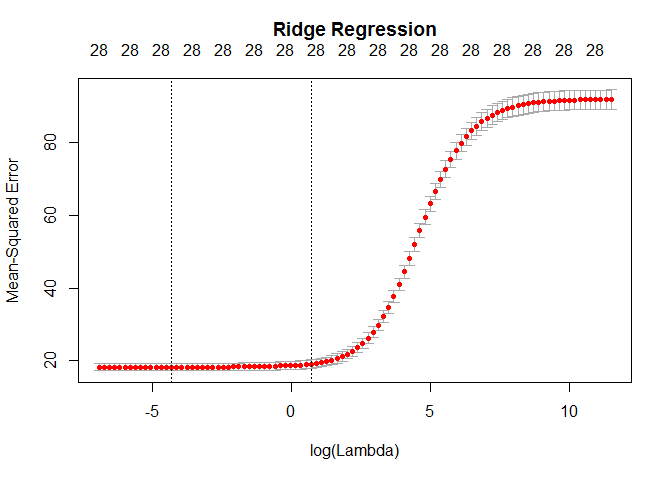

``` r
bestlambda.ridge = cv.ridge.out$lambda.min
bestlambda.ridge # 0.01353048 best lamda for our ridge regression
```

    ## [1] 0.01353048

``` r
log(bestlambda.ridge) # -4.302811 log of best lamda for our ridge regression
```

    ## [1] -4.302811

``` r
#What is the test MSE associated with this best value of lambda?

ridge.bestlambdatrain = predict.cv.glmnet(cv.ridge.out, s ="lambda.min", newx = x[test, ]) 
mean((ridge.bestlambdatrain - y.test)^2) #MSE = 17.29462
```

    ## [1] 17.29462

``` r
#What is the test RMSE associated with this best value of lambda?
sqrt(mean((ridge.bestlambdatrain - y.test)^2)) #RMSE = 4.15868
```

    ## [1] 4.15868

``` r
#What is the accuracy of our model after 10-fold cross validation?
compare <- cbind(actual = y.test, ridge.bestlambdatrain)
compare <- data.frame(compare)
compare  = compare %>% rename(., predicted = X1)
mean (apply(compare, 1, min)/apply(compare, 1, max)) # 96.46492% accuracy of our trained model to our test sample
```

    ## [1] 0.9646492

#### (optional) We can use feature selection (remove features with high coefficients) to further tune the linear model
