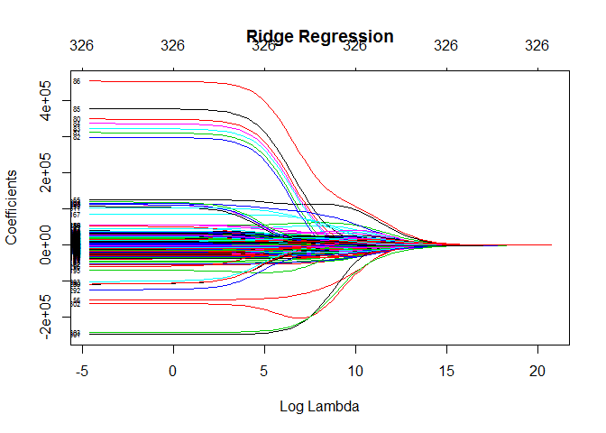
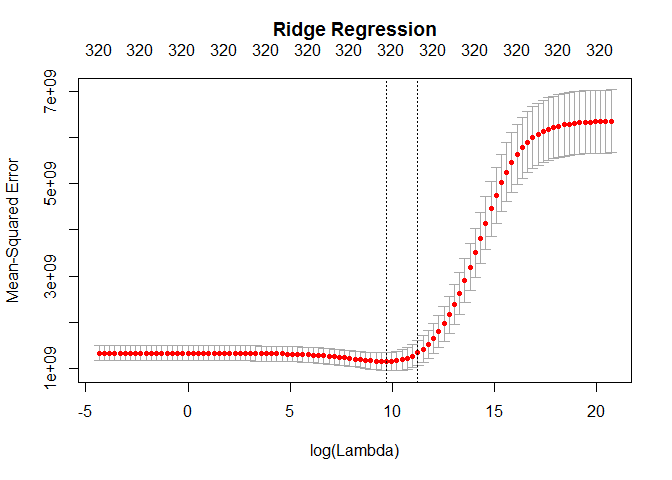

Training a Ridge Regression Model for Categorical Features
================

``` r
library(data.table)
library(dplyr)
library(glmnet)
library(highcharter)
```

#### Getting Started

``` r
cats_df <- fread("train_cats.csv")
cats_df$V1 = NULL 

cats_df <- cats_df %>% mutate_if(is.character,as.factor)

quants_df <- fread('train_quants.csv')

SalePrice <- quants_df$SalePrice

#this adds SalePrice to our categorical dataset ()
merged <- cbind(cats_df,SalePrice)

#Remove ID and V1 columns
merged = merged[,-c(1,2)]
```

#### Ridge Regression Model

``` r
#Need matrices for glmnet() function. Automatically conducts conversions as well
#for factor variables into dummy variables.
x = model.matrix(SalePrice ~ ., merged)[, -1] #Dropping the intercept column. After dummification we get 327 features!
y = merged$SalePrice

#Values of lambda over which to check.
grid = 10^seq(9, -2, length = 100)

ridge.models = glmnet(x, y, alpha = 0, lambda = grid)

plot(ridge.models, xvar = "lambda", label = TRUE, main = "Ridge Regression")
```



#### Cross-Validation

``` r
set.seed(0)
train = sample(1:nrow(x), 7*nrow(x)/10)
test = (-train)
y.test = y[test]

length(train)/nrow(x)
```

    ## [1] 0.7

``` r
length(y.test)/nrow(x)
```

    ## [1] 0.3

``` r
set.seed(0)
cv.ridge.out = cv.glmnet(x[train, ], y[train],
                         lambda = grid, alpha = 0, nfolds = 10)
plot(cv.ridge.out, main = "Ridge Regression\n")
```



``` r
bestlambda.ridge = cv.ridge.out$lambda.min
bestlambda.ridge
```

    ## [1] 16681.01

``` r
log(bestlambda.ridge)
```

    ## [1] 9.722026

``` r
#What is the test RMSE associated with this best value of lambda?
ridge.bestlambdatrain = predict.cv.glmnet(cv.ridge.out, s ="lambda.min", newx = x[test, ])
sqrt(mean((ridge.bestlambdatrain - y.test)^2)) #our predicted prices are off by about $47k on average.
```

    ## [1] 46998.77

``` r
compare <- cbind(y.test, ridge.bestlambdatrain)
compare <- data.frame(compare)
compare  = compare %>% rename(., predicted = X1)

mean(apply(compare, 1, min)/apply(compare, 1, max)) 
```

    ## [1] 0.867633

**86.78% accuracy achieved using Ridge Regression on Categorical Features.**

